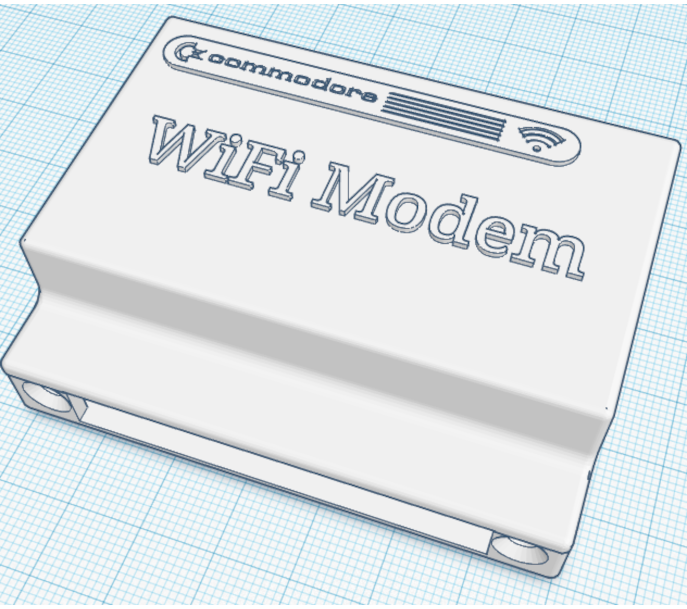
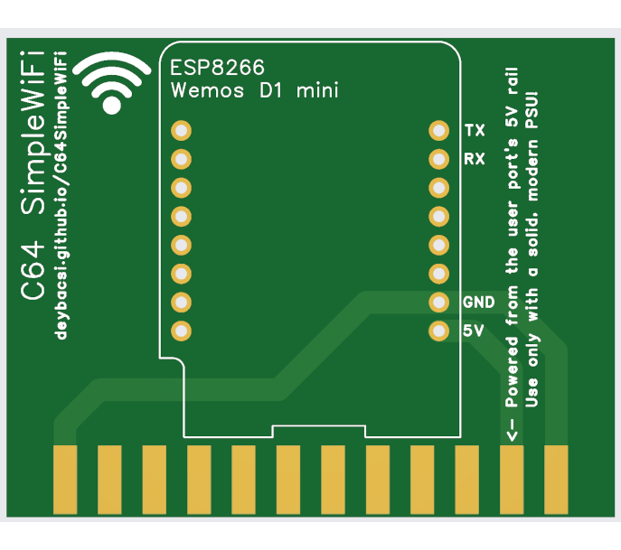

# C64 Simple WiFi

**Simple WiFi solution for your not-so-simple C64**

## What is it?

C64 SimpleWiFi is a minimalistic WiFi modem interface for the Commodore 64. It plugs into the C64's user port and uses a Wemos D1 mini (ESP8266) module running modem firmware such as [Zimodem](https://github.com/bozimmerman/Zimodem).

The goal: make a **super simple**, **super cheap**, **zero-bullshit** solution to get your C64 online with a fascinating speed of 2400bits/sec! SimpleWiFi is the bare minimum, **just enough to work**, nothing more.

This is something even a total beginner can build at home. You don't even need the PCB, just a Wemos D1 mini, an edge connector, and four wires will do the trick.

If you don’t want to burden your C64 by drawing 5V from the user port, you can get away with just three wires and power the Wemos via an external USB power supply instead.

## Key Features

* Plugs into the user port, so the cartridge port remains free.
  You can still use a fastloader or any other expansion there
* Hayes modem compatible (AT commands)
* Compatible with CCGMS C64 terminal software
* Powered directly from C64 userport, or from an external usb power supply
* No level shifters, or extra circuitry, no LEDs, no buttons, no frills
* Designed to use the absolute minimum number of components and easiest DIY assembly
* Maximum 2400 bits/sec speed
* Can also be used over USB when plugged into a PC!
  Works with the VICE emulator, allowing you to connect to BBSes even from emulated environments

## What it’s not

* It’s not bulletproof. If you plug this into a C64 with a crappy PSU or short something, that’s on you
* It’s not a polished commercial product. It’s a very simple DIY project by a fellow retro nerd

## Disclaimer

This is a hobby project provided "as is", with no guarantees or warranties of any kind.

It has been successfully tested on my own C64C using a reliable power supply, and it works as intended in that environment.

However, I take no responsibility for any damage, malfunction, or unexpected behavior that may result from using, modifying, or misusing this device, including (but not limited to) damage to your Commodore 64, power supply, or any connected equipment.

If you build, flash, plug in, or otherwise interact with this project, you do so entirely at **your own risk**.

No support, no refunds, no blame.

## Required Components

To build the C64 SimpleWiFi modem, you'll need the following parts:

| Wemos D1 mini   (ESP8266-based WiFi microcontroller)   [Link to buy](https://www.aliexpress.com/item/1005007470858524.html)                   | 2x 12-pin 805-24P edge connector   (for C64 user port connection)   [Link to buy](https://www.aliexpress.com/item/1005004642271363.html) (Select 2x12 (24P) variant)                                    |
|-----------------------------------------------------------------------|-----------------------------------------------------------------------------------------------------|
|                                                |                                                                              |

| 3D-printed enclosure   (optional but recommended for protection and style)   [Link to case](https://www.thingiverse.com/thing:4658368) | 3/4 wires **OR** Prototype PCB   [Link to gerber files](C64-SimpleWiFi-gerber)  |
|-----------------------------------------------------------------------|-----------------------------------------------------------------------------------------------------|
|                                                |                                                            |

Also you'll have to download a terminal software like [CCGMS](https://github.com/mist64/ccgmsterm)

## Wiring Guide

Below is a simple wiring diagram showing how to connect the Wemos D1 mini to the Commodore 64 user port using a standard edge connector:

| C64 User Port | Signal | Wemos D1 mini     |
|---------------|--------|-------------------|
| Pin 2         | 5V     | 5V                |
| Pin A+N       | GND    | GND               |
| Pin B+C       | RX←TX  | TX (3.3V output)  |
| Pin M         | TX→RX  | RX (5V input)     | 

> ⚠️ C64 TX to Wemos RX is 5V → 3.3V. Technically **unsafe**, but it works in practice. Use at your own risk.

This setup requires just four wires. If you want to power the Wemos externally via USB, you can omit the 5V (red) line from the C64 and use only three wires.

> ⚠️ **Warning:** Don’t connect **both** USB and C64 5V power at the same time. The two supplies may conflict and damage your hardware. Pick one, not both!

## How to Use

1. Flash your Wemos D1 mini with [Zimodem](https://github.com/bozimmerman/Zimodem) (or other compatible modem firmware) from a PC
2. Setup Zimodem (Connect to WiFi, and setup speed - recommended: 2400 baud - this is the max for this modem)
3. Solder the module and the edge connector directly onto the board
   OR
   solder everything with wires
4. Plug it into the user port of your C64
5. Connect with terminal software (e.g. CCGMS) (Setup CCGMS modem type for Zimodem and 2400baud)
6. Surf the BBS world like it’s 1988

## Zimodem flash & configuration

TODO

## CCGMS setup

TODO

## Voltage Level Note

The C64 user port outputs 5V TTL signals. The ESP8266 expects 3.3V on its RX pin, and according to the current official specs, 5V input is not guaranteed to be safe.
That said, earlier versions of the datasheet listed 5V-tolerant inputs, and real-world use shows that most ESP8266 boards (including the Wemos D1 mini) survive and function just fine when fed 5V UART from the C64.

And hey, even if the ESP blows up, what’s the real damage? You just lost \$3. It’s cheaper than a pizza.

On the flip side, the ESP's 3.3V TX signal is no problem for the C64; it cleanly registers as a valid logic high anything above 3V.

> ⚠️**Warning:** **If you're unsure or not confident with electronics, don't take unnecessary risks. Either build (or buy) a more complex WiFi modem with a proper level shifter, or ask someone who knows what they're doing.**

> **It's not worth the stress or frying a perfectly working C64.**

> ⚠️**Warning**: Do not connect both the C64 5V and USB power at the same time. Use one power source only! Otherwise you risk damaging your C64, USB adapter, or Wemos.

According to the C64 user port specification, it can provide a maximum of 100 mA on the 5V line.
The Wemos D1 mini typically draws around 70-80 mA on average, so it's within safe limits under normal operation. You can find measurements [here](https://salvatorelab.com/2023/01/wemos-d1-mini-deep-sleep-current-draw/#:~:text=When%20active%20and%20connected%20to,right%20numbers%20on%20the%20screenshot.&text=During%20deep%20sleep%20the%20current%20is%209.05mA.).

## Inspiration & Thanks

This project is heavily based on the guide at [RetroGameCoders](https://retrogamecoders.com/commodore-64-wifi-esp8266/). The core idea and wiring are almost the same, this version just provides more detailed documentation. And a manufacturable PCB design :)
